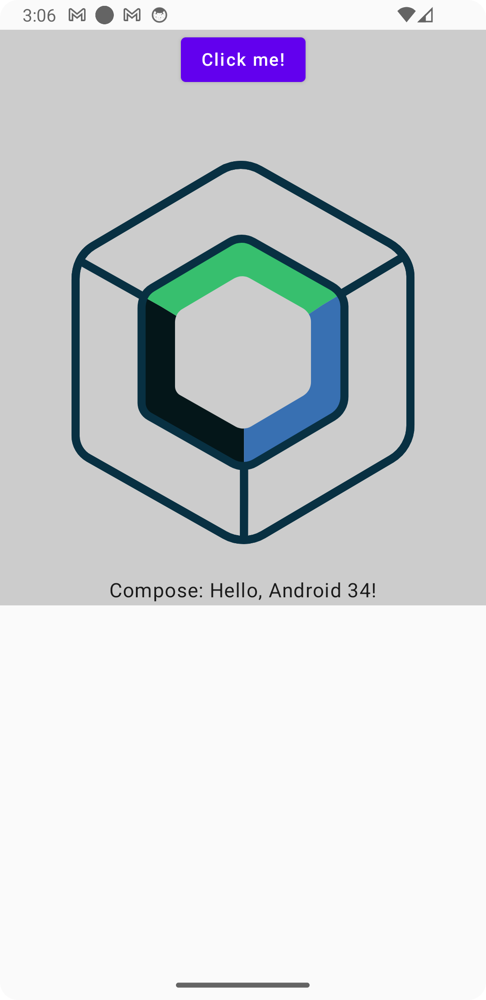

# Compose StatusBar

A Kotlin Multiplatform library for managing status bar appearance in Compose applications. While
Android's `enableEdgeToEdge` can handle status bar management, iOS lacks a direct equivalent. This
library provides a unified solution for both platforms, making status bar management seamless across
Android and iOS.

[](https://central.sonatype.com/artifact/io.github.bentleypark/compose-statusbar)
[](https://opensource.org/licenses/MIT)

## Screenshot

### iOS

| Default iOS Status Bar                                                            | Custom Status Bar                                                               |
|-----------------------------------------------------------------------------------|---------------------------------------------------------------------------------|
|  |  |

### Android

| Default Android Status Bar                                                                | Custom Status Bar                                                                       |
|-------------------------------------------------------------------------------------------|-----------------------------------------------------------------------------------------|
|  |  |

*Status bar customization with compose-statusbar on both platforms*

## Features

- Cross-platform status bar management (Android & iOS)
    - Android: Enhanced control beyond `enableEdgeToEdge`
    - iOS: Full status bar customization support (not available in native SwiftUI)
- Easy status bar and navigation/tab bar color configuration
- Independent control of top and bottom system bars
- Compose Multiplatform support
- Safe area handling for edge-to-edge designs

## Installation

Add the dependency to your project:

```kotlin
dependencies {
    implementation("io.github.bentleypark:compose-statusbar:1.0.6")
}
```

## Why This Library?

While Android provides `enableEdgeToEdge()` for status bar management, iOS lacks equivalent
functionality in SwiftUI. This library bridges that gap by offering:

- Unified API across platforms
- iOS status bar customization without UIKit complexity
- Seamless integration with Compose Multiplatform

## Usage

Basic usage examples:

```kotlin
// Basic status bar configuration
@Composable
fun BasicExample() {
    ConfigureStatusBar(
        color = Color.Green,
        onDispose = { /* Optional cleanup */ }
    )

    // Your screen content
}

// Status bar with bottom bar configuration
@Composable
fun FullSystemBarsExample() {
    ConfigureStatusBar(
        color = Color.Green,                // Status bar color
        bottomBarColor = Color.White,       // Navigation/Tab bar color
        onDispose = { /* Optional cleanup */ }
    )

    // Your screen content
}
```

Note: `bottomBarColor` is optional. When not specified, the bottom bar (navigation bar on Android,
tab bar on iOS) remains in its default state.

## Sample App

Check out the sample app in the `sample` directory for comprehensive examples demonstrating various
features and implementation patterns.

## License

MIT License

Copyright (c) 2025 Bentley Park

Permission is hereby granted, free of charge, to any person obtaining a copy
of this software and associated documentation files (the "Software"), to deal
in the Software without restriction, including without limitation the rights
to use, copy, modify, merge, publish, distribute, sublicense, and/or sell
copies of the Software, and to permit persons to whom the Software is
furnished to do so, subject to the following conditions:

The above copyright notice and this permission notice shall be included in all
copies or substantial portions of the Software.

THE SOFTWARE IS PROVIDED "AS IS", WITHOUT WARRANTY OF ANY KIND, EXPRESS OR
IMPLIED, INCLUDING BUT NOT LIMITED TO THE WARRANTIES OF MERCHANTABILITY,
FITNESS FOR A PARTICULAR PURPOSE AND NONINFRINGEMENT. IN NO EVENT SHALL THE
AUTHORS OR COPYRIGHT HOLDERS BE LIABLE FOR ANY CLAIM, DAMAGES OR OTHER
LIABILITY, WHETHER IN AN ACTION OF CONTRACT, TORT OR OTHERWISE, ARISING FROM,
OUT OF OR IN CONNECTION WITH THE SOFTWARE OR THE USE OR OTHER DEALINGS IN THE
SOFTWARE.